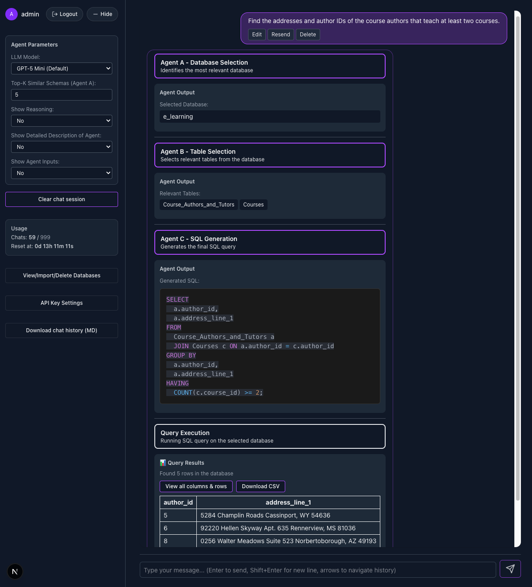

# Explainable Natural Language Query Interface for Relational Databases Using a Multi-Agent System
For CITS5553 - Data Science Capstone Project | Semester 2, 2025

---

<p align="center">
  
</p>

---

## Setup Guide

This project is designed to be run entirely using Docker. No manual Python or Conda environment setup is required.  


### 1. Download and Prepare the Spider Dataset

- **Download the Spider Dataset:**
  - Visit: https://yale-lily.github.io/spider  
    or use the direct link: [Google Drive Download](https://drive.google.com/file/d/1403EGqzIDoHMdQF4c9Bkyl7dZLZ5Wt6J/view)
  - Download the ZIP file to your computer.

- **Extract and Place the Dataset:**
  - Unzip the file. The folder should be named `spider_data`.
  - Move or copy this folder into the `data` directory at the root of this project, so you have: `data/spider_data`

  Your directory should look like:
  ```
  data/
  └── spider_data/
      └── test_database/
          ├── academic/
          │   ├── academic.sqlite
          │   └── schema.sql
          ├── flight_1/
          │   ├── flight_1.sqlite
          │   └── schema.sql
          ├── car_1/
          │   ├── car_1.sqlite
          │   └── schema.sql
          └── ... (200+ more databases)
  ```

  > **Note:** The Spider databases are not included in this repository due to size. Each user must download and place them manually.


### 2. Install Docker

- Download Docker Desktop: [https://www.docker.com/products/docker-desktop/](https://www.docker.com/products/docker-desktop/)
- Install for your OS (Windows, macOS, or Linux).
- **Start Docker Desktop** and wait until it is running.

### 3. Start the Application

- Open a terminal and navigate to the web application directory:
  ```bash
  cd web_app
  ```
- Start the application with Docker Compose:
  ```bash
  docker-compose up --build
  ```
  > The first run may take a few minutes as Docker builds the images.

- The Docker setup automatically mounts the `../data` directory, so your Spider databases (if present) will be accessible to the backend.

### 4. Access the Application

- **Frontend:** [http://localhost:3000](http://localhost:3000)
- **Backend API:** [http://localhost:8000](http://localhost:8000)
- **Django Admin:** [http://localhost:8000/admin](http://localhost:8000/admin)

### 5. Login Credentials

- **Django Admin Login (optional):**
  - Visit [http://localhost:8000/admin](http://localhost:8000/admin)
  - Login 
      - **Username:** `admin`
      - **Password:** `admin123`
  
- **Web Application Login:**
  - Log in at [http://localhost:3000](http://localhost:3000)
  - Use the same credentials (`admin` / `admin123`)


### 6. Add Your OpenAI API Key

- After logging in, click the **"API Key Settings"** button in the menu.
- Enter your OpenAI API key (get one from [https://platform.openai.com/account/api-keys](https://platform.openai.com/account/api-keys)).
- Click **Save**.

  > **Note:** Each user must enter their own OpenAI API key. The `.env` file API key is only for development/testing.

### 7. Add the Spider Databases

- Go to "View/Import/Delete Databases" in the menu.
- Click the purple **"Add All Spider"** button to upload all Spider databases and generate their schemas.

### 8. Test the Agents

- Go to the chatbot and ask questions about your databases.
**Example question:**  
> Find the name of all students who were in the tryout sorted in alphabetic order
- The AI agents will use your API key to generate SQL queries and provide explanations.
- Play with Agent Parameters

---

**Troubleshooting:**  
If you encounter issues, ensure Docker is running and the `data/spider_data` directory exists (if using the Spider dataset).  
For further help, consult your team.