# Architecture Diagrams

This document contains Mermaid diagrams describing the architecture of the Explainable NL Query DB Agents application.

## 1. System Architecture Overview

## 2. Agent Processing Flow

## 3. Component Structure

## 4. Data Flow Architecture

```mermaid
flowchart TD
    %% User Input
    User[👤 User Input<br/>Natural Language Query]
    
    %% Frontend Processing
    UI[🖥️ Frontend UI<br/>React/Next.js]
    
    %% API Gateway
    API[🌐 Django REST API<br/>Authentication & Routing]
    
    %% Agent Pipeline
    subgraph Pipeline["🤖 Agent Processing Pipeline"]
        A[Agent A<br/>Database Selection]
        B[Agent B<br/>Table Selection]
        C[Agent C<br/>SQL Generation]
        D[Agent D<br/>SQL Execution]
    end
    
    %% External Services
    AIService[🧠 AI Service<br/>LLM API]
    Database[🗄️ Database<br/>SQLite/CSV Files]
    
    %% Data Storage
    subgraph Storage["💾 Data Storage"]
        FileStorage[File Storage<br/>Uploaded DBs]
        UserData[User Data<br/>Chats & Settings]
        Cache[Cache Layer<br/>Agent Results]
    end
    
    %% Results
    Results[📊 Query Results<br/>Structured Data]
    
    %% Flow Connections
    User --> UI
    UI <--> API
    
    API --> Pipeline
    A --> B
    B --> C
    C --> D
    
    C <--> AIService
    D <--> Database
    
    API <--> Storage
    
    Pipeline --> Results
    Results --> UI
    UI --> User
    
    %% Styling
    classDef user fill:#ffcdd2
    classDef frontend fill:#e1f5fe
    classDef backend fill:#f3e5f5
    classDef agent fill:#fff3e0
    classDef external fill:#e8f5e8
    classDef storage fill:#fce4ec
    
    class User user
    class UI frontend
    class API backend
    class A,B,C,D agent
    class AIService,Database external
    class FileStorage,UserData,Cache storage
```

## 5. Database Schema

## 6. Deployment Architecture

```mermaid
graph TB
    %% Container Layer
    subgraph "🐳 Docker Containers"
        Frontend[Frontend Container<br/>Next.js<br/>Port: 3001]
        Backend[Backend Container<br/>Django<br/>Port: 8000]
    end

    %% Volume Mounts
    subgraph "📁 Volume Mounts"
        BackendCode[./backend:/app]
        MediaFiles[backend_media:/app/media]
        DataFiles[../data:/data]
    end

    %% Host System
    subgraph "💻 Host System"
        LocalBackend[./backend/]
        LocalData[../data/]
        LocalMedia[media files]
    end

    %% Network
    subgraph "🌐 Network"
        Port3001[Host:3001]
        Port8000[Host:8000]
    end

    %% External Dependencies
    subgraph "🔗 External Services"
        AIProvider[AI API Provider<br/>OpenAI/Anthropic/etc]
        Files[Database Files<br/>SQLite/CSV]
    end

    %% Connections
    Port3001 --> Frontend
    Port8000 --> Backend
    
    Backend --- BackendCode
    Backend --- MediaFiles
    Backend --- DataFiles
    
    BackendCode --- LocalBackend
    DataFiles --- LocalData
    MediaFiles --- LocalMedia
    
    Backend --> AIProvider
    Backend --> Files
    Frontend --> Backend

    %% Styling
    classDef container fill:#e1f5fe
    classDef volume fill:#fff3e0
    classDef host fill:#e8f5e8
    classDef network fill:#f3e5f5
    classDef external fill:#ffcdd2

    class Frontend,Backend container
    class BackendCode,MediaFiles,DataFiles volume
    class LocalBackend,LocalData,LocalMedia host
    class Port3001,Port8000 network
    class AIProvider,Files external
```

## Architecture Summary

### Technologies Used:
- **Frontend**: Next.js 15, React 19, TypeScript, Tailwind CSS
- **Backend**: Django, Django REST Framework, Python
- **Database**: SQLite (for metadata), CSV/SQLite files (for data)
- **AI Integration**: API calls to LLM services
- **Deployment**: Docker, Docker Compose

### Main Processing Flow

1. User enters natural language question through web interface
2. Frontend sends request to Django REST API
3. Backend runs 4-agent pipeline sequentially:
   - Agent A: Select appropriate database
   - Agent B: Select relevant tables/columns
   - Agent C: Generate SQL query with AI
   - Agent D: Execute SQL and return results
4. Results are streamed back to frontend in real-time
5. User views formatted and explained results

### Key Features

- Chatbot interface with streaming responses
- File upload and database management
- User authentication and rate limiting
- API key management for AI services
- Real-time query explanation and results
